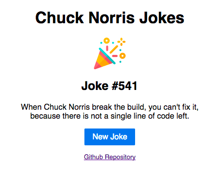

# Chuck Norris Jokes Vue.js app on SAP Cloud Platform

A small [Chuck Norris Jokes App](https://chucknorrisjokesvuesapcp-d062712trial.dispatcher.hanatrial.ondemand.com/index.html?hc_reset) using [Vue.js](https://vuejs.org/) using the [Chuck Norris API](http://www.icndb.com/api/) for hosting on SAP Cloud Platform using the **Connectivity Service**.

Import the file *chucknorrisjokes* inside the **destination** folder into your SAP Cloud Platform Cockpit under **Connectivity -> Destinations -> Import Destination**.

Deploy it to your SAP Cloud Platform from inside the SAP Web IDE.

Enjoy 😉

## Demo
Running demo application: [Chuck Norris Jokes Vue.js app hosted on SAP Cloud Platform](https://chucknorrisjokesvuesapcp-d062712trial.dispatcher.hanatrial.ondemand.com/index.html?hc_reset)

## Libraries
Used libraries:
* [Vue.js](https://vuejs.org/)
* [PureCSS](https://purecss.io/)
* 
## Info
* [neo-app.json](https://help.sap.com/viewer/65de2977205c403bbc107264b8eccf4b/Cloud/en-US/aed1ffa3f3e741b3a4573c9e475aa2a4.html)
